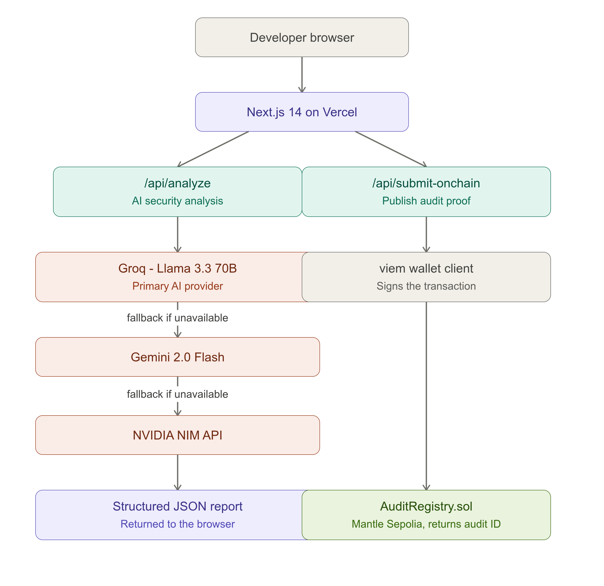
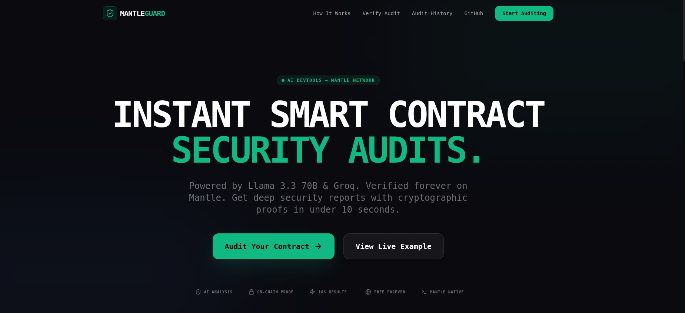
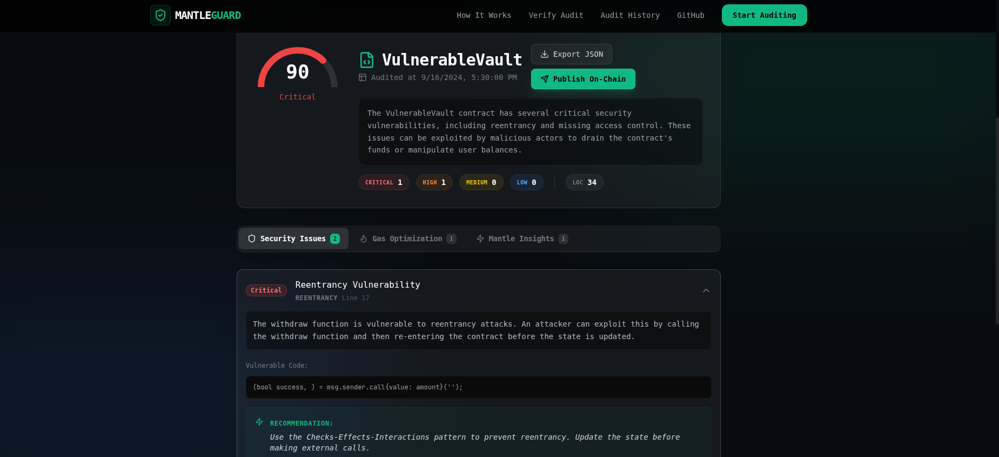
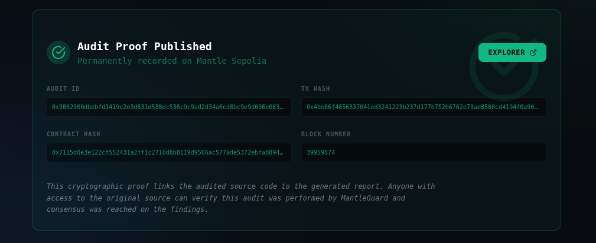
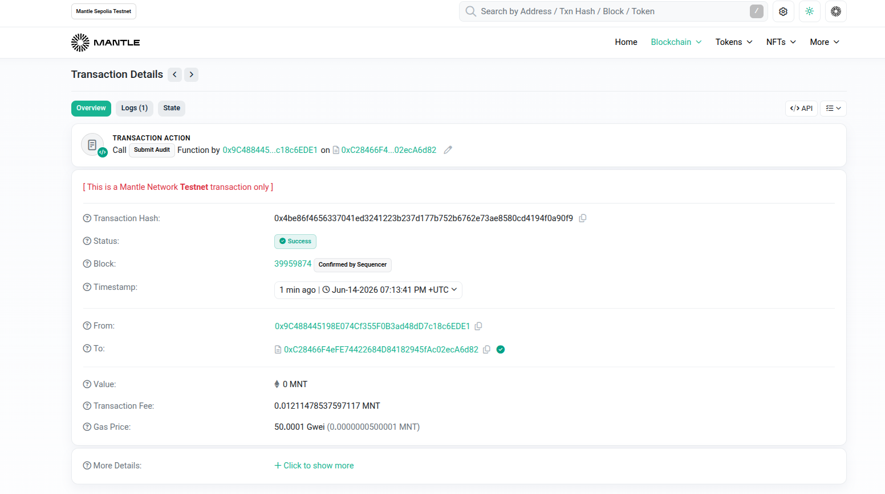

# MANTLEGUARD v2.0

### Instant AI Smart Contract Auditor with On-Chain Proof

**MantleGuard** is the first AI-powered smart contract security auditor where every finding is permanently verifiable on the Mantle Network. Built for the **Mantle Turing Test Hackathon 2026 (Track 05: AI DevTools)**.

---

## 🚀 Live Links

- **Live App**: [mantleguard.vercel.app](https://mantleguard.vercel.app)
- **Deployed Contract**: [0xC28466F4eFE74422684D84182945fAc02ecA6d82](https://explorer.sepolia.mantle.xyz/address/0xC28466F4eFE74422684D84182945fAc02ecA6d82)
- **Demo Video**: [Watch demo](https://youtu.be/c1pAbGkFwTc)

---

## ✨ Features

- **Instant AI Audit**: Powered by Llama 3.3 70B via Groq for deep security analysis in under 10 seconds.
- **On-Chain Proof**: Every audit generates a cryptographic fingerprint recorded immutably on Mantle Sepolia.
- **3-Provider Fallback**: High reliability with automatic switching between Groq, Gemini, and NVIDIA NIM providers.
- **Mantle Native**: Specific checks for mETH, USDY, and L2 gas optimizations.
- **Verified Certificates**: Shareable, tamper-proof audit certificates with unique Audit IDs.
- **CI/CD Integration**: GitHub Actions template for automated security checks on every commit.
- **Self-Hardened Core**: The `AuditRegistry` contract was audited by MantleGuard itself, and the AI-recommended `ReentrancyGuard` and input-validation fixes were applied before the final verified deployment.

---

## 🛡️ Self-Hardening Case Study

To prove MantleGuard's value, we ran our own first deployed `AuditRegistry.sol` through MantleGuard before finalizing this project — and applied the fixes it recommended.
 
- **Findings**: MantleGuard flagged a reentrancy risk in `submitAudit()` and recommended adding OpenZeppelin's `ReentrancyGuard`, plus stricter input validation for hashes, addresses, and IPFS CIDs.
- **Fixes Applied**: The hardened contract adds `ReentrancyGuard`, a Checks-Effects-Interactions pattern, and new explicit validation errors (`AuditAlreadyExists`, `InvalidAddress`, `InvalidIPFS`) that did not exist in the original version.
- **Verifiable On-Chain**:
  - **Original contract** (pre-audit, unverified): [`0x63027A5831b851F3311031BF0756FdB9186c2a3D`](https://sepolia.mantlescan.xyz/address/0x63027A5831b851F3311031BF0756FdB9186c2a3D)
  - **Hardened contract** (post-audit, verified, current production): [`0xC28466F4eFE74422684D84182945fAc02ecA6d82`](https://sepolia.mantlescan.xyz/address/0xC28466F4eFE74422684D84182945fAc02ecA6d82)
- **Result**: MantleGuard helped harden the exact contract it now runs on — a real, checkable example of AI output becoming a deployed, verified blockchain fact.
---

## 🛠 Tech Stack

- **Frontend**: Next.js 14, Tailwind CSS, Framer Motion, Lucide React
- **Blockchain**: Mantle Network (Sepolia Testnet), Viem, Solidity
- **AI Engine**: Llama 3.3 70B (via Groq), Gemini 2.0 Flash, Meta Llama 3.1 70B (via NVIDIA NIM)
- **Infrastructure**: Vercel, GitHub Actions

---

## 📐 Architecture

## 📸 Screenshots

| Landing Page                               | Audit Report                             |
| ------------------------------------------ | ---------------------------------------- |
|  |  |

| On-Chain Proof                         | Mantle Explorer                              |
| -------------------------------------- | -------------------------------------------- |
|  |  |

---

## 📦 Getting Started

### Prerequisites

- Node.js 20+
- pnpm

### Installation

1. Clone the repo: `git clone https://github.com/sadik-tofik/MANTLEGUARD`
2. Install deps: `pnpm install`
3. Set up `.env.local` using `.env.example`
4. Run dev: `pnpm dev`

---

## 📄 API Reference

### `POST /api/analyze`

Analyzes Solidity source code using the AI fallback chain.

- **Body**: `{ "sourceCode": "string" }`
- **Response**: `AuditReport` object with issues and risk score.

### `GET /api/verify?auditId=0x...`

Verifies an audit record stored on the Mantle blockchain.

- **Response**: `OnChainAuditRecord` if found.

---

## 🏆 Hackathon Alignment

MantleGuard v2.0 is designed to dominate the **Track 05: AI DevTools** by demonstrating:

1. **Technical Excellence**: Complex multi-provider AI pipeline + robust blockchain integration.
2. **Ecosystem Fit**: Directly serves Mantle developers and generates on-chain activity.
3. **Innovation**: The first tool to combine AI audits with on-chain cryptographic verifiability.
4. **User Experience**: A premium, responsive web app that simplifies a complex security workflow.

---

## 📜 License

This project is licensed under the MIT License - see the [LICENSE](LICENSE) file for details.

© 2026 MantleGuard Team. Built with 💚 for Mantle.
